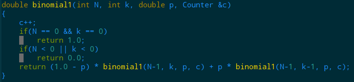
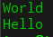

<script type="text/javascript" src="http://cdn.mathjax.org/mathjax/latest/MathJax.js?config=default"></script>
# Chapter 1
## 1.1 基础编程模型
### 1.1.27
**二项分布**
计算递归次数可以用下一节中即将用到的[Counter](./Counter.hpp)类。代码如下所示。计算结果大约是100！次递归调用。  
  
可以使用数组保存已经计算过的值，完整代码见[Binomial.hpp](./Binomial.hpp)和[Binomial.cpp](./Binomial.cpp)。

## 1.2 数据抽象
### 1.2.4
结果：   

### 1.2.6 
**回环变位**
```
s.size() == t.size() && (s+t).find(t) != string::npos;
```
### 1.2.7
将s逆置。
### 1.2.13
仿照[Date.hpp](./Date.hpp)和[Date.cpp](./Date.hpp)实现[Transaction.hpp](./Transaction.hpp)和[Transaction.cpp](Transaction.cpp)就好。
### 1.2.14
参见[Transaction.hpp](./Transaction.hpp)和[Transaction.cpp](Transaction.cpp)。
### 1.2.16 
**有理数**
参见[Rational.hpp](./Rational.hpp)和[Rational.cpp](./Rational.cpp)。
### 1.2.18
**累加器的方差** ***参考[这里](https://www.johndcook.com/blog/standard_deviation/)***  
主要是说标准的方差计算公式——直接对所有数据的平方求和在样本数据和均值都很大的时候会出现数值上的误差，B.P.Welford在1962年提出了一种新的计算方差的方法。具体如下：  
初始化 $M_1 = x_1$ and $S_1 = 0$.

对于接下来的每个 $x$, 使用下面的递归公式计算$M$和$S$:

$$M_k = M_{k-1}+ (x_k – M_{k-1})/k$$
$$S_k = S_{k-1} + (x_k – M_{k-1})*(x_k – M_k)$$
For $2 ≤ k ≤ n$, the $k^{th}$ estimate of the variance is $s^2 = S_k/(k – 1)$.  
这中方法不需要保存所有的数据，来一个数据就能计算均值和方差。  
体现在代码中就是书上那段代码。
### 1.2.19
**字符串解析**  
参考[Date.hpp](./Date.hpp)、[Date.cpp](./Date.hpp)、[Transaction.hpp](./Transaction.hpp)和[Transaction.cpp](Transaction.cpp)。C++中需要自己实现一个字符串的`split`方法，使用`STL`也没有什么麻烦的。
## 1.3 背包、队列和栈
### 1.3.1
很简单。直接在[FixedCapacityStackOfStrings](./FixedCapacityStackOfStrings.h)中添加一个方法：
```
bool isFull()
{
	return N == cap;
}
```
### 1.3.2
输出：`was best times of the was the it (1 left on stack)`
### 1.3.3
b 不可能出现。因为按照前面的输出情况`1`不可能在`0`的前面出栈；  
f 也不可能出现。`1`不可能在`7`前面出栈；  
g 不可能出现。`0`不可能在`2`前面出栈。
### 1.3.4
栈的标准用法。见[Parentheses](./Parentheses.cpp)。  
遇到左括号入栈，右括号出栈，看出栈的和外面的右括号是否匹配，如果不匹配则直接返回`false`。匹配则继续，直到最后，如果栈为空则返回`true`，否则返回`false`。
### 1.3.5
当N为50时会打印`110010`，也即N的二进制表示。
### 1.3.6
逆置队列q中的所有元素。
### 1.3.7
只要返回元素不更改指针就行了。
```
T peak()
{
    return first->item;
}
```
### 1.3.10
见[InfixToPostfix.cpp](./InfixToPostfix.cpp)。  
简单起见，我们只考虑`+ - * / （ ）`六种操作符（注意：`(`优先级最低，`+`、`-`次之，`*`、`/`最高）。我们将输入的字符串从左到右遍历，对遇到的每个字符做如下处理：
* 遇到数字直接打印出来
* 遇到左括号则直接压入栈中；
* 遇到右括号则输出从栈中弹出的元素一直到左括号为止的所有元素；
* 遇到操作符时先判断栈是否为空，如果为空则直接将操作符入栈，如果不为空又有两种情况：如果栈顶元素比当前操作符低则直接将操作符压入栈中，否则弹出打印栈顶元素并继续上述判断。  

### 1.3.11
见[EvaluatePostfix.cpp](./EvaluatePostfix.cpp)**(在这个C++实现中用了C++11标准中的function类型)**。
思路如下：
* 如果遇到数字，则直接入栈
* 如果遇到操作符，则将栈中的数字弹出两个，执行操作符对应的操作，再将结果入栈。

最后栈中的数字就是结果。
### 1.3.13
(b)不可能。在`4`出列之前`1`、`2`、`3`一定已经被出列了。同理(c)、(d)也不可能。
### 1.3.37
**Josephus问题**  
见[Josephus.cpp](Josephus.cpp)。
### 1.3.42
见[Stack.h](Stack.h)。主要需要注意的是要拷贝链表。
### 1.3.45
**栈的可生成性**  
（1）：对于某个整数 k ，如果前 k 次出栈操作会在前 k 次入栈操作之前完成则栈会向下溢出，否则不会。  
（2）：如果可以产生某个排列，那么它的产生方式一定是唯一的。那么判断测试用例能否产生某个指定的排列的算法如下：一个一个读取输入的序列，比较它跟输出排列的下一个整数，如果输出排列中的下一个整数在栈顶，则将它弹出，否则将它入栈。
### 1.3.46
**栈的可生成性中禁止出现的排列**  
设有这样一个三元组(a, b, c)，c会在a和b之前被弹出，但是a和b会在c之前被亚茹。因此，当c被压入时，a和b都已经在栈中。所以，a不可能会在b之前被弹出。


